<div align="center">

# DENTRA

**The intelligent operating system for dental clinics.**

Patients, appointments, clinical charts, treatments, inventory, billing and an AI copilot, all in one workspace.


[Features](#features) · [Screenshots](#screenshots) · [Getting started](#getting-started) · [Tech stack](#tech-stack) · [Deployment](#deployment)

<br />

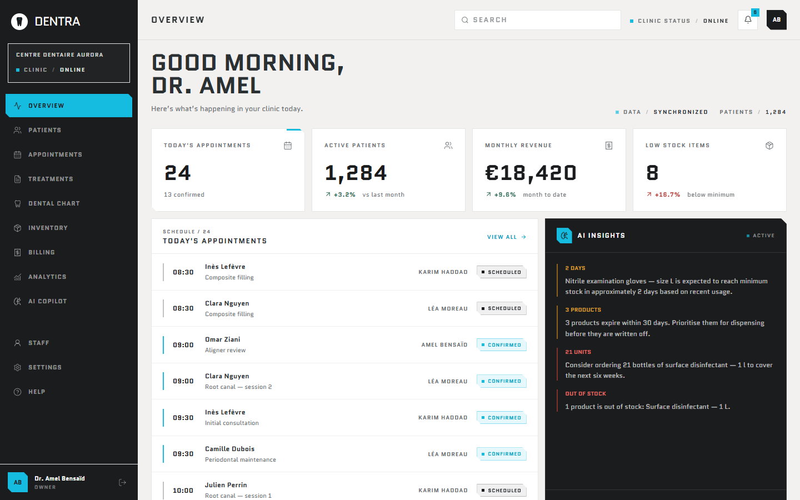

</div>

## Overview

DENTRA brings the daily operations of a dental practice into a single dashboard. The front desk sees the day's schedule, the dentist charts teeth and follows treatment plans, the practice manager tracks stock and invoices, and an AI copilot answers questions about the clinic's own data.

The app runs out of the box in **demo mode** with a realistic sample clinic, so it can be evaluated without any backend.

## Features

| Module | Description |
| --- | --- |
| **Overview** | Today's appointments, active patients, monthly revenue, low-stock alerts and AI insights at a glance |
| **Patients** | Searchable patient registry with status, assigned dentist, last visit and next appointment |
| **Appointments** | Day, week and month calendar views, filterable by dentist and status |
| **Dental chart** | Interactive odontogram in FDI notation, with per-tooth conditions and a summary |
| **Treatments** | Treatment plans with step-by-step progress timelines and planned value |
| **Inventory** | Stock levels, expiry tracking and AI restocking recommendations |
| **Billing** | Invoices, payment status, overdue tracking and payment recording |
| **Analytics** | Revenue, appointments, new and returning patients, no-show rate, over 7 days to 12 months |
| **AI copilot** | Natural-language questions about the schedule, recalls, stock, revenue and treatment plans |
| **Staff** | Team members, roles, licences and workload |

## Screenshots

### Landing page

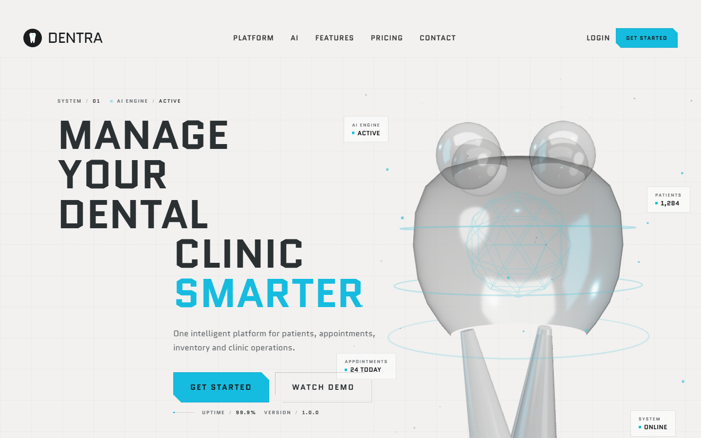

### Patient registry and schedule

<table>
  <tr>
    <td width="50%">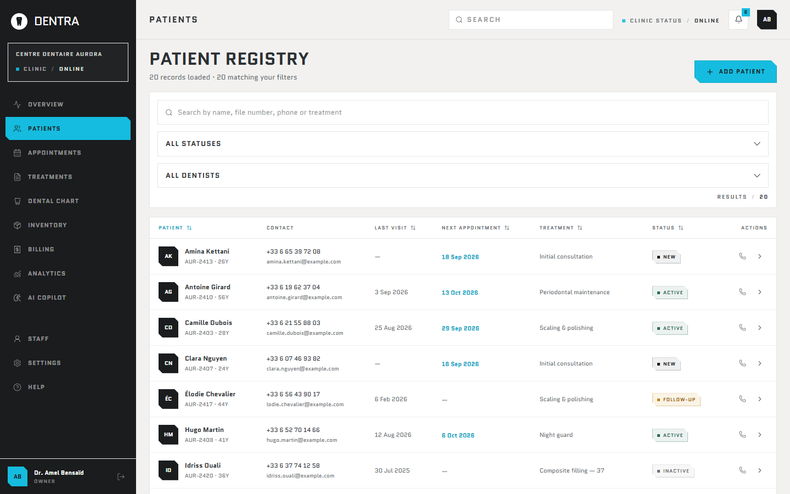</td>
    <td width="50%">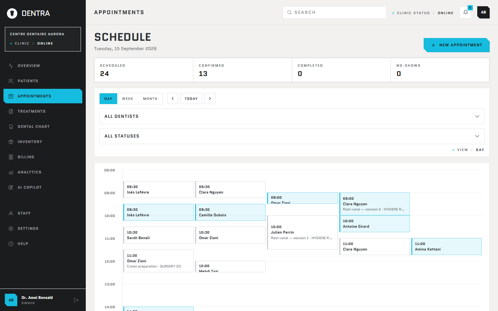</td>
  </tr>
  <tr>
    <td align="center"><sub>Patient registry</sub></td>
    <td align="center"><sub>Appointment schedule</sub></td>
  </tr>
</table>

### Clinical

<table>
  <tr>
    <td width="50%">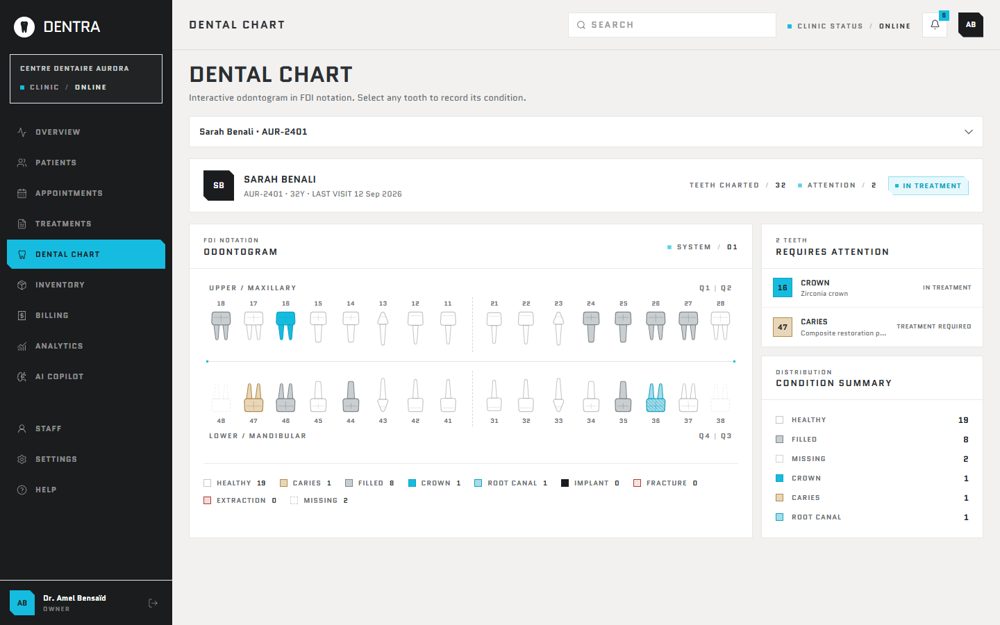</td>
    <td width="50%">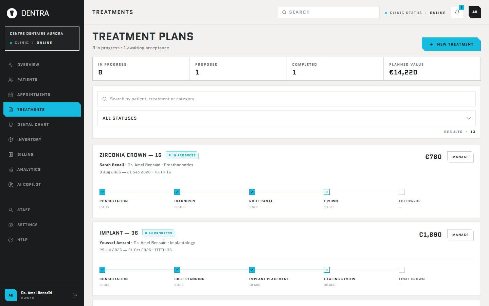</td>
  </tr>
  <tr>
    <td align="center"><sub>Interactive dental chart (FDI)</sub></td>
    <td align="center"><sub>Treatment plans</sub></td>
  </tr>
</table>

### Operations

<table>
  <tr>
    <td width="50%">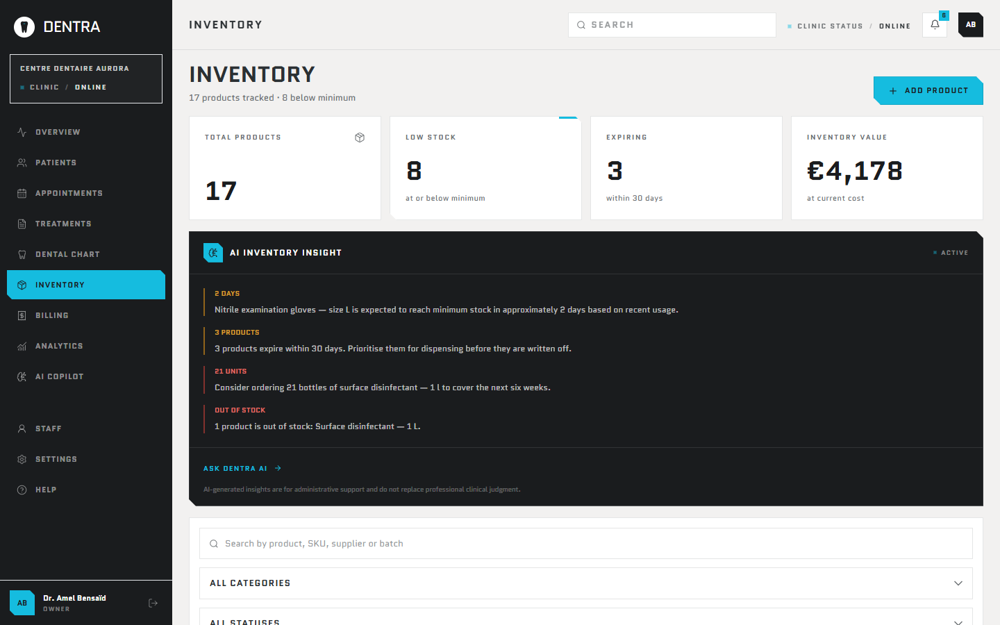</td>
    <td width="50%">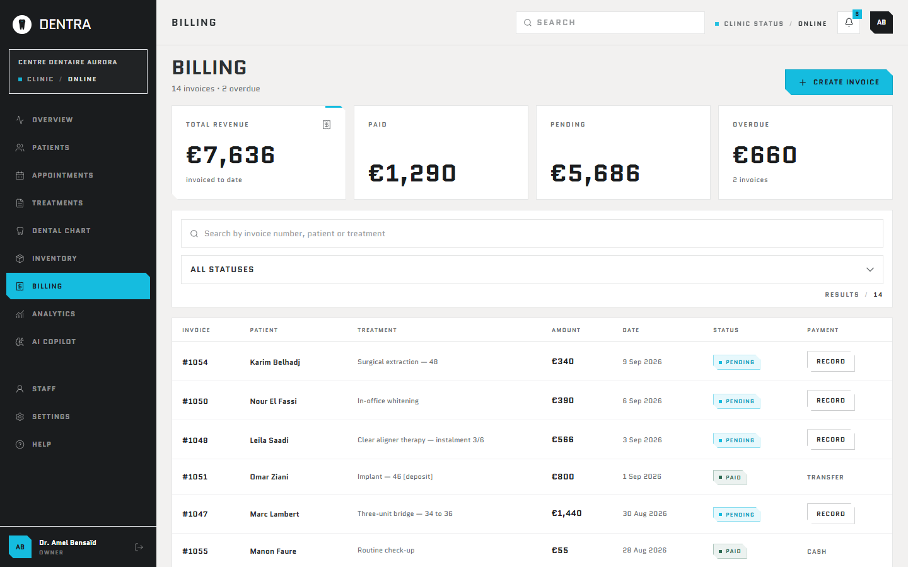</td>
  </tr>
  <tr>
    <td align="center"><sub>Inventory with AI insights</sub></td>
    <td align="center"><sub>Billing</sub></td>
  </tr>
</table>

### Insights

<table>
  <tr>
    <td width="50%">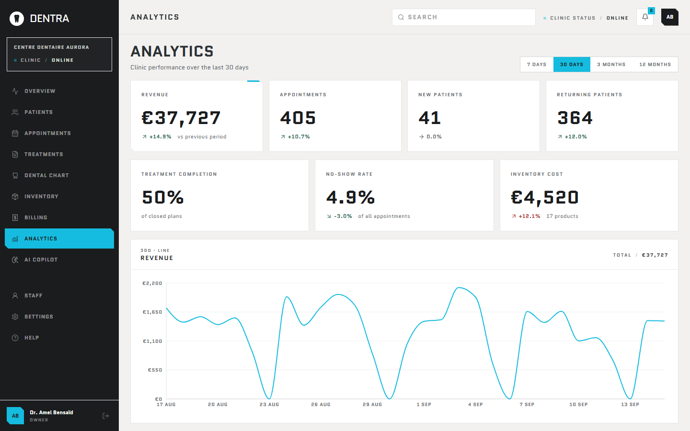</td>
    <td width="50%">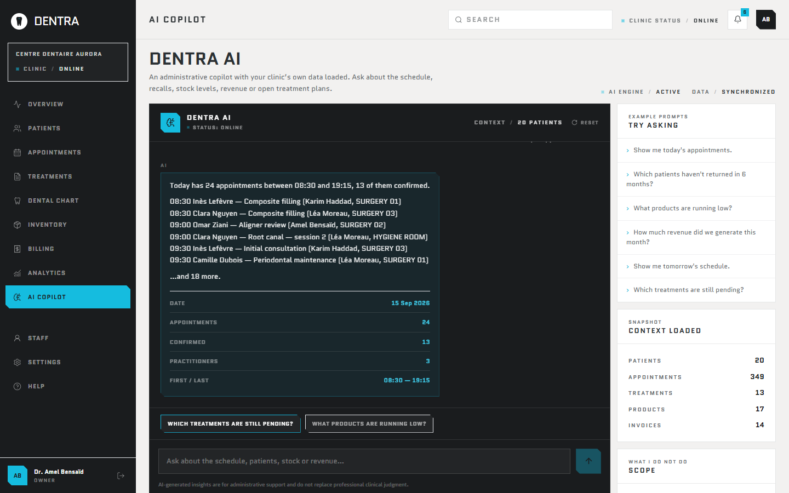</td>
  </tr>
  <tr>
    <td align="center"><sub>Analytics</sub></td>
    <td align="center"><sub>AI copilot</sub></td>
  </tr>
</table>

### Team and access

<table>
  <tr>
    <td width="50%">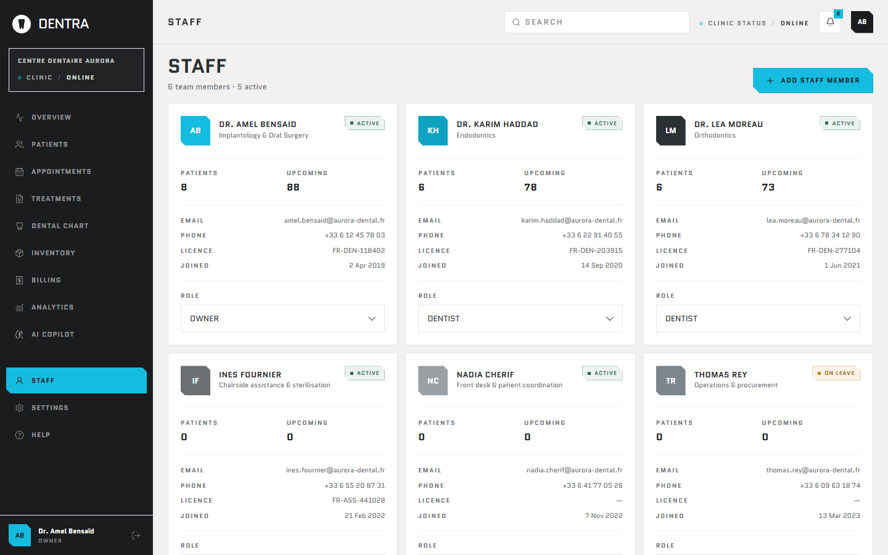</td>
    <td width="50%">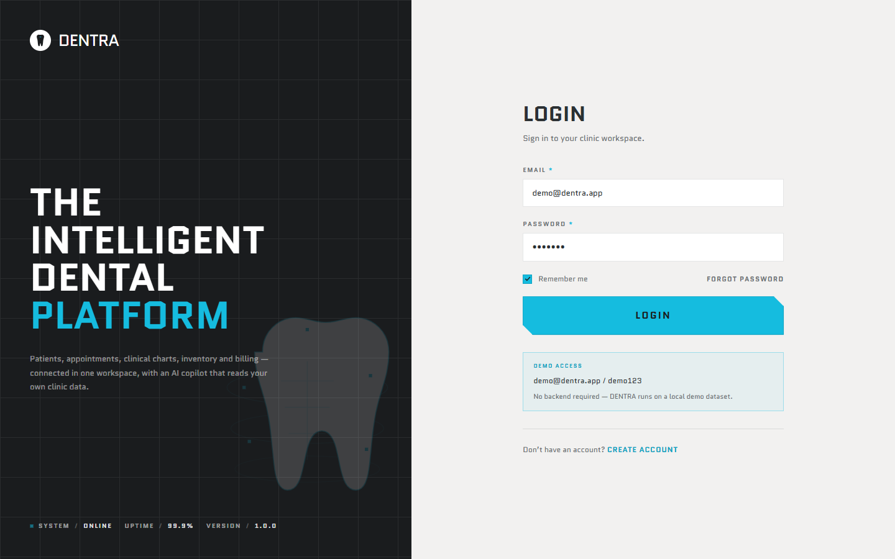</td>
  </tr>
  <tr>
    <td align="center"><sub>Staff</sub></td>
    <td align="center"><sub>Login</sub></td>
  </tr>
</table>

## Getting started

### Prerequisites

- Node.js 20 or later
- npm

### Installation

```bash
git clone https://github.com/zdorsane/dentra-.git
cd dentra-
npm install
npm run dev
```

Open [http://localhost:3000](http://localhost:3000).

### Demo mode

With no environment variables set, DENTRA runs on a local demo dataset (mock data and a local session, no network calls). Sign in with:

| Email | Password |
| --- | --- |
| `demo@dentra.app` | `demo123` |

The demo session is for evaluating the product only. It is not a security boundary.

### Connecting Supabase (optional)

Copy `.env.example` to `.env.local` and fill in your project's values:

```bash
NEXT_PUBLIC_SUPABASE_URL=https://your-project.supabase.co
NEXT_PUBLIC_SUPABASE_ANON_KEY=your-anon-key
```

When these are set, authentication goes through Supabase Auth instead of the demo session.

## Scripts

| Command | Description |
| --- | --- |
| `npm run dev` | Start the development server |
| `npm run build` | Create a production build |
| `npm run start` | Serve the production build |
| `npm run lint` | Run ESLint |
| `npm run typecheck` | Type-check the project without emitting files |

## Tech stack

| Area | Technology |
| --- | --- |
| Framework | [Next.js 15](https://nextjs.org/) (App Router), React 19 |
| Language | TypeScript |
| Styling | Tailwind CSS |
| Animation | Framer Motion |
| Charts | Recharts |
| 3D | Three.js, React Three Fiber, Drei |
| Icons | Lucide |
| Backend (optional) | Supabase |

## Project structure

```
app/            Routes: landing, auth, onboarding and dashboard modules
components/     UI components grouped by feature (ai, appointments, dental, ...)
lib/            Auth, data access, mock data, client store and utilities
types/          Shared TypeScript types
public/         Static assets
docs/           Screenshots used in this README
```

## Deployment

DENTRA is deployed on [Vercel](https://vercel.com). Every push to `main` triggers a production deployment, and every pull request gets its own preview URL.

To deploy your own copy:

1. Import the repository at [vercel.com/new](https://vercel.com/new).
2. Keep the detected Next.js settings.
3. Optionally add the Supabase variables under **Settings → Environment Variables**.
4. Deploy.
